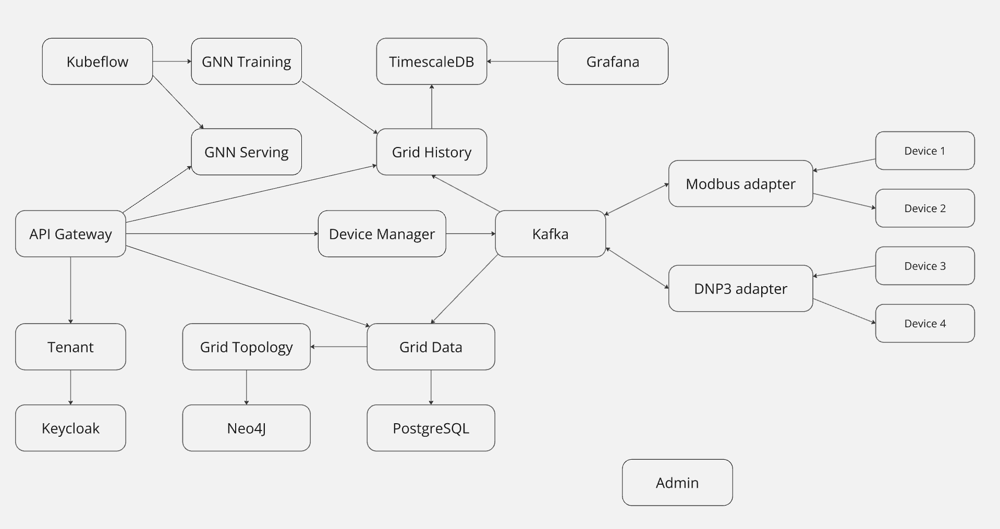

# Intnet: Electric Grid Management Platform

Intnet is a learning project designed to explore the complexities of electric grid management through a modern, distributed systems approach. While not intended for production deployment, it serves as a comprehensive demonstration of **microservices architecture**, **data streaming**, **real-time analytics**, and **machine learning operations (MLOps)** in the context of critical infrastructure.
This repository contains the source code for the Web Frontend. See [Intnet-Platform](https://github.com/TudorOrban/Intnet-Platform) for the backend.

---

## Project Highlights

* **Microservices Architecture:** Built with a strong emphasis on decoupling and scalability, allowing independent development and deployment of components.
* **Real-time Data Ingestion:** Utilizes Kafka for high-throughput streaming of grid data from simulated and adapted devices.
* **Data Management:** Separates current and historical data, leveraging dedicated services for optimal access patterns.
* **Machine Learning Integration:** Features a Graph Neural Network (GNN) for grid analysis, trained on synthetically generated data via numerical Optimal Power Flow (OPF) solving.
* **MLOps with Kubeflow:** Demonstrates end-to-end machine learning workflows, including training and deployment, using Kubeflow.
* **Grid Visualization and Editing**: Includes an intuitive and modern interface for interacting with the grid.

**Please Note:** This project is a work in progress and was primarily developed for educational purposes. It has known issues and is not production-ready.

---

## Architecture Overview

Intnet adopts a **microservices paradigm**, where distinct functionalities are encapsulated within independent services that communicate primarily through message queues and APIs. The following diagram represents the architecture of the main Intnet components:

## Getting Started

To use or develop Intnet, you can either run a setup script:
`cd scripts`, `chmod +x initialize_intnet.sh`, `./initialize_intnet.sh`
or set it up manually by following these steps:
1. Ensure you have installed: Docker, Minikube, Helm, KubeCTL, Java JDK 21. The ML modules also require a newer version of Python.
2. Fetch the [Intnet-Platform](https://github.com/TudorOrban/Intnet-Platform) repository and open a terminal in the root.
3. You need to build a Docker image for each microservice you want to use. For instance, for `intnet-grid-data`, you need to:
a. navigate to the microservice root: `cd services/intnet-grid-data`
b. Build the Java project: `mvn clean package -DskipTests`
c. Build the image: `eval $(minikube docker-env)` and `docker build -t intnet-grid-data:latest .`
4. Start Minikube and install Kubernetes deployments with Helm: `helm install std-release .`. Scale each service as needed by modifying the `replicaCount` in `kubernetes/dev/helm/values.yaml`.
5. To interact with the system, port-forward the API gateway, for instance `kubectl port-forward service/std-release-intnet-renai-gateway 8080:8080`. You can now make calls to `localhost:8080`
6. Optionally, fetch and run (`ng serve`) the [Web Frontend](https://github.com/TudorOrban/Intnet-WebFrontend) to edit your grid, set up devices etc.

# Status
In mid stages of development.

## Contributing
All contributions are warmly welcomed. Head over to [CONTRIBUTING.md](https://github.com/TudorOrban/Intnet-WebFrontend/blob/main/CONTRIBUTING.md) for details.